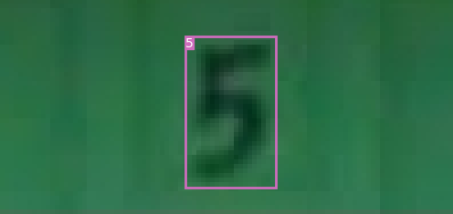
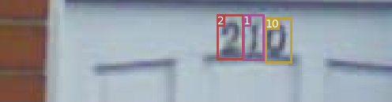
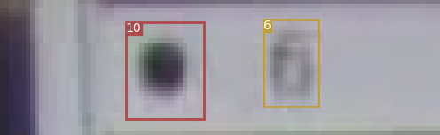
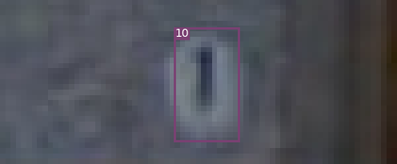

# HW3
A PyTorch implementation of YOLOv3, which heavily borrow from https://github.com/eriklindernoren/PyTorch-YOLOv3

    
## Test

    $ python3 test.py --weights_path <checkpoint or pretrained weight>


## Inference

    $ python3 detect.py --image_folder data/samples/ --model_def config/yolov3-custom.cfg --class_path data/custom/classes.names --weights_path checkpoints/yolov3_ckpt_xx.pth 

<p align="center"></p>
<p align="center"></p>
<p align="center"></p>
<p align="center"></p>

## Train
```
$ train.py [-h] [--epochs EPOCHS] [--batch_size BATCH_SIZE]
                [--gradient_accumulations GRADIENT_ACCUMULATIONS]
                [--model_def MODEL_DEF] [--data_config DATA_CONFIG]
                [--pretrained_weights PRETRAINED_WEIGHTS] [--n_cpu N_CPU]
                [--img_size IMG_SIZE]
                [--checkpoint_interval CHECKPOINT_INTERVAL]
                [--evaluation_interval EVALUATION_INTERVAL]
                [--compute_map COMPUTE_MAP]
                [--multiscale_training MULTISCALE_TRAINING]
```

## Train on Custom Dataset

#### Custom model
Run the commands below to create a custom model definition, replacing `<num-classes>` with the number of classes in your dataset.

```
$ cd config/                                # Navigate to config dir
$ bash create_custom_model.sh <num-classes> # Will create custom model 'yolov3-custom.cfg'
```

#### Classes
Add class names to `data/custom/classes.names`. This file should have one row per class name.

#### Image Folder
Move the images of your dataset to `data/custom/images/`.

#### Annotation Folder
Move your annotations to `data/custom/labels/`. The dataloader expects that the annotation file corresponding to the image `data/custom/images/train.jpg` has the path `data/custom/labels/train.txt`. Each row in the annotation file should define one bounding box, using the syntax `label_idx x_center y_center width height`. The coordinates should be scaled `[0, 1]`, and the `label_idx` should be zero-indexed and correspond to the row number of the class name in `data/custom/classes.names`.

#### Define Train and Validation Sets
In `data/custom/train.txt` and `data/custom/valid.txt`, add paths to images that will be used as train and validation data respectively.

#### Train
To train on the custom dataset run:

```
$ python3 train.py --model_def config/yolov3-custom.cfg --data_config config/custom.data
```

Add `--pretrained_weights weights/darknet53.conv.74` to train using a backend pretrained on ImageNet.


## Credit

### YOLOv3: An Incremental Improvement
_Joseph Redmon, Ali Farhadi_ <br>

### [eriklindernoren/PyTorch-YOLOv3](https://github.com/eriklindernoren/PyTorch-YOLOv3)

